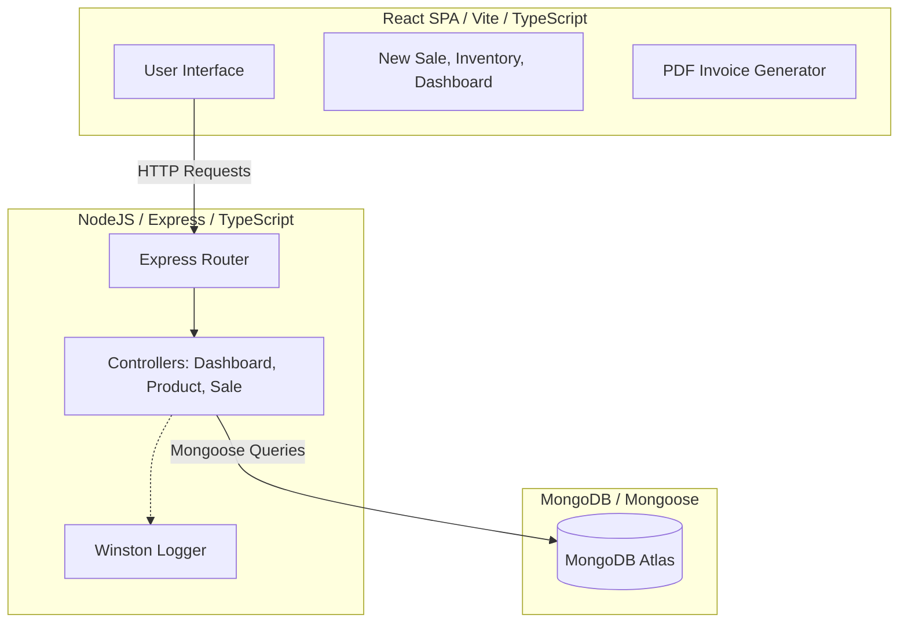
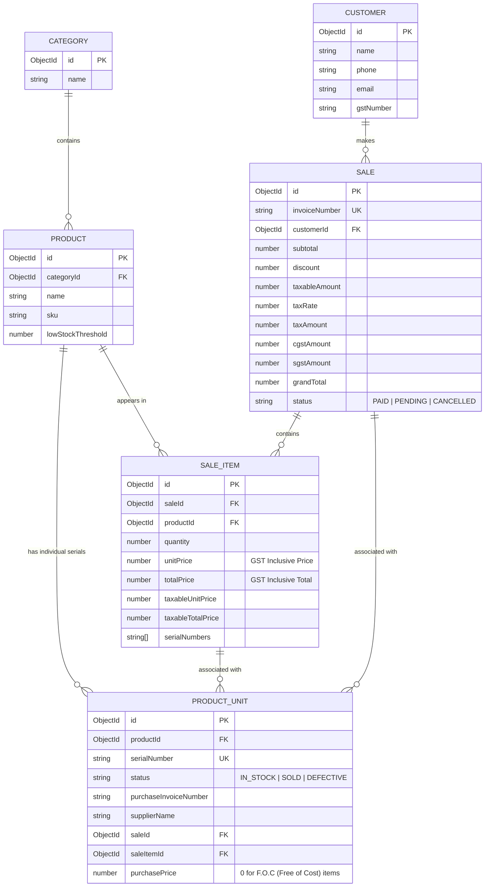

# System Architecture & Flow Guide

This document provides a comprehensive overview of the architecture, database models, and transactional flows of the **Anshika Enterprises Inventory & Billing System**. It is designed to give any AI or developer instant context on how the system works.

---

## 1. Overall System Architecture

The application is built on a standard **MERN** (MongoDB, Express, React, Node) stack setup using TypeScript.

---

## 2. Database Models & Schema Relationships

Instead of basic quantity tracking, this system uses **serial-level item tracking** via the `ProductUnit` model.

---

## 3. Key Core Workflows

### A. Stock In (Purchase / Inventory Add)
1. The user inputs product details, including serial numbers, purchase price, supplier name, etc.
2. If the product is **F.O.C (Free of Cost)**, the `purchasePrice` is stored as `0`.
3. For each serial number provided, a unique `ProductUnit` document is created in the database with status `IN_STOCK`.

### B. Stock Out (Sales Checkout & Invoice Generation)
When a sale is recorded:
1. Selling prices entered by the user are **GST-Inclusive**.
2. The system splits the prices to calculate taxable amount, CGST, and SGST:
   - $$\text{Taxable Unit Price} = \frac{\text{Inclusive Price}}{1 + \text{Tax Rate}}$$ (e.g., $$\frac{200}{1.18} = 169.49$$)
   - $$\text{Tax Amount} = \text{Inclusive Price} - \text{Taxable Unit Price}$$ (e.g., $$200 - 169.49 = 30.51$$)
   - For intra-state transactions, Tax Amount is split into:
     - $$\text{CGST} = \frac{\text{Tax Amount}}{2}$$
     - $$\text{SGST} = \frac{\text{Tax Amount}}{2}$$
3. The `Sale` and `SaleItem` records are saved with the split values.
4. The corresponding `ProductUnit` documents matched by serial numbers are updated:
   - `status` is set to `SOLD`.
   - `saleId` and `saleItemId` are linked.

---

## 4. Key Metrics & Calculations

### A. Dashboard Inventory Value
* Calculated dynamically by aggregating the `purchasePrice` of all `ProductUnit` documents where `status == 'IN_STOCK'`.
* F.O.C items correctly contribute `0` value.

### B. Low Stock Alert
* The system counts the number of `ProductUnit` documents with `status == 'IN_STOCK'` for each product.
* If $$\text{count} \le \text{lowStockThreshold}$$ (default 5), the product is flagged in the low stock alerts list.

---

## 5. Technical Context & Gotchas

* **No direct quantity counter on Product:** Stock quantities are computed dynamically from `ProductUnit` documents to ensure tracking consistency at the serial number level.
* **GST Treatment:** All retail price inputs are GST-inclusive. The base rate (taxable value) is displayed on invoices, but the totals are matched to the exact inclusive payments.
